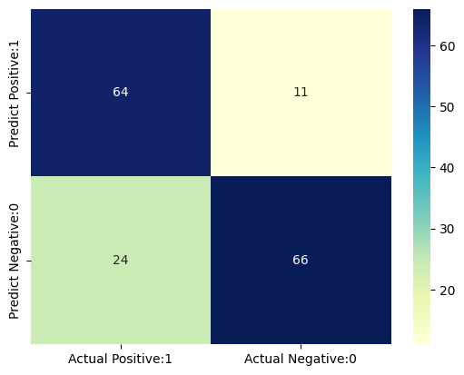

### Table of Contents

- [Heart Attack Prediction](#heart-attack-prediction)
- [Dataset](#dataset)
  - [Correlation Heatmap](#correlation-heatmap)
  - [Confusion Matrix Logistic Regression](#confusion-matrix-logistic-regression)
  - [Confusion Matrix LGBM](#confusion-matrix-lgbm)
  - [Confusion Matrix XGB Classifier](#confusion-matrix-xgb-classifier)
  - [Confusion Matrix Gaussian Naive Bayes](#confusion-matrix-gaussian-naive-bayes)
- [Installation](#installation)
- [Usage](#usage)

## Heart Attack Prediction

This repository contains a Jupyter notebook for predicting heart attacks using machine learning models. The dataset used in this project includes various health metrics and indicators to help predict the likelihood of a heart attack.

## Dataset

The dataset used in this project is Dataset Heart Disease.csv. It contains the following columns:

- `age`: Age of the patient
- `sex`: Gender of the patient (1 = male, 0 = female)
- `chest` pain type: Type of chest pain experienced
- `resting bps`: Resting blood pressure
- `cholesterol`: Cholesterol level
- `fasting blood sugar`: Fasting blood sugar level (1 = true, 0 = false)
- `resting ecg`: Resting electrocardiographic results
- `max heart rate`: Maximum heart rate achieved
- `exercise angina`: Exercise-induced angina (1 = yes, 0 = no)
- `oldpeak`: ST depression induced by exercise relative to rest
- `ST slope`: Slope of the peak exercise ST segment
- `target`: Heart disease (1 = yes, 0 = no)

### Correlation Heatmap


### Confusion Matrix Logistic Regression


### Confusion Matrix LGBM


### Confusion Matrix XGB Classifier


### Confusion Matrix Gaussian Naive Bayes


## Installation

To run this project, you need to install the required libraries. You can install them using pip:

```bash
pip install scikit-learn==1.5.2 pandas numpy matplotlib plotly seaborn
```
## Usage
To use this repository, clone it and navigate to the directory:

```bash
git clone https://github.com/SleepyMiner/Heart-Attack-Prediction.git
cd Heart-Attack-Prediction
```

Open the Jupyter notebook:
```bash
jupyter notebook HeartAttackPrediction.ipynb
```
